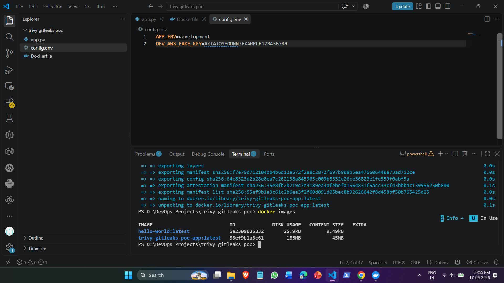
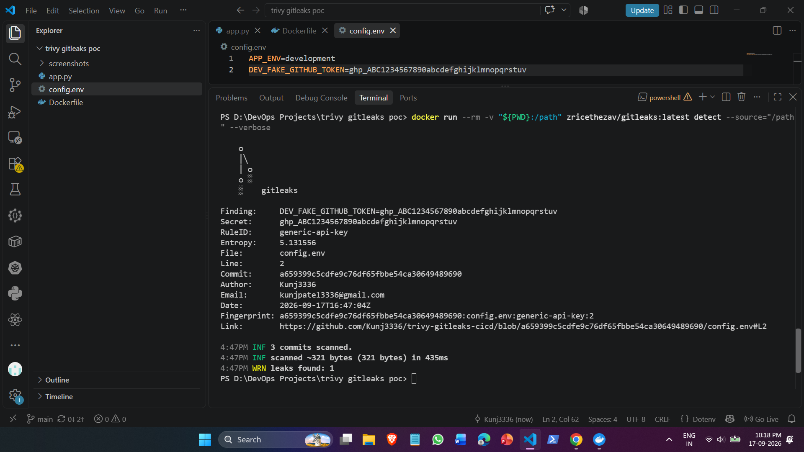
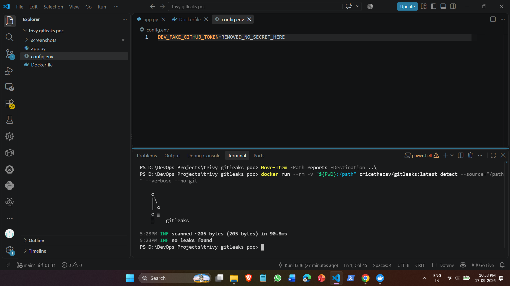
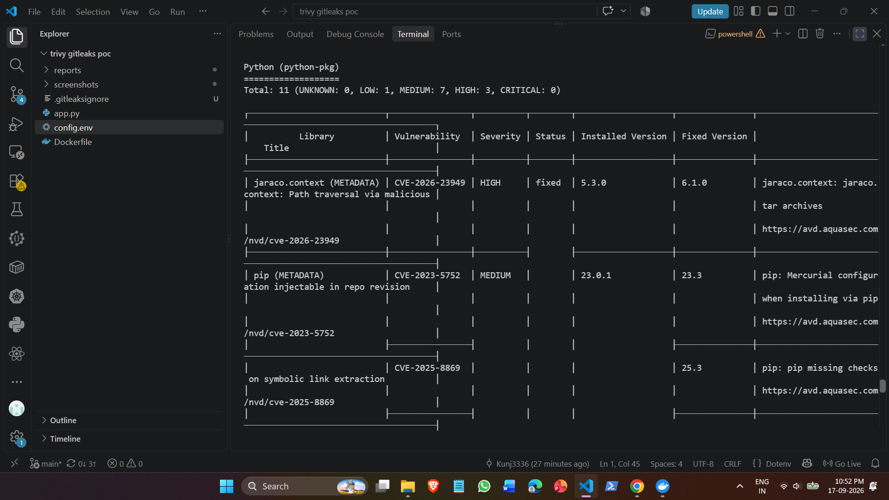
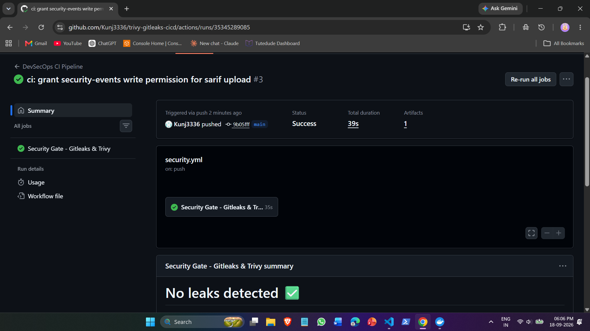
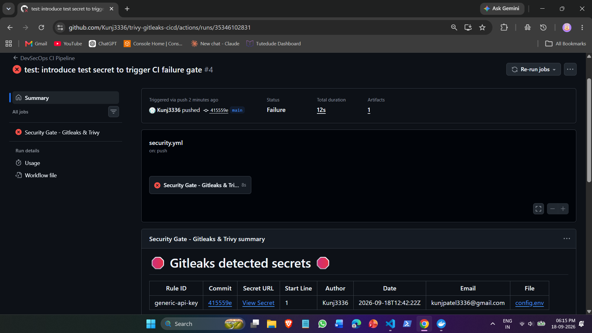
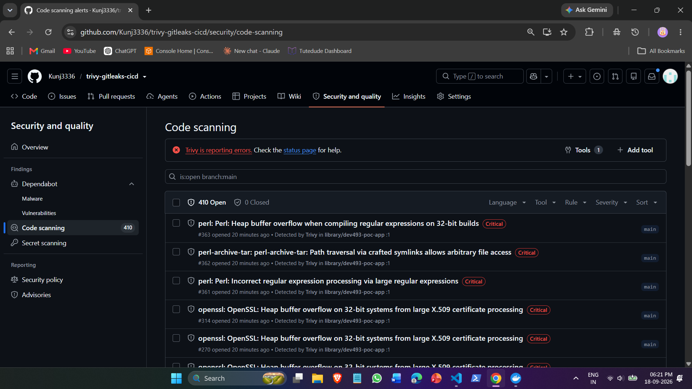
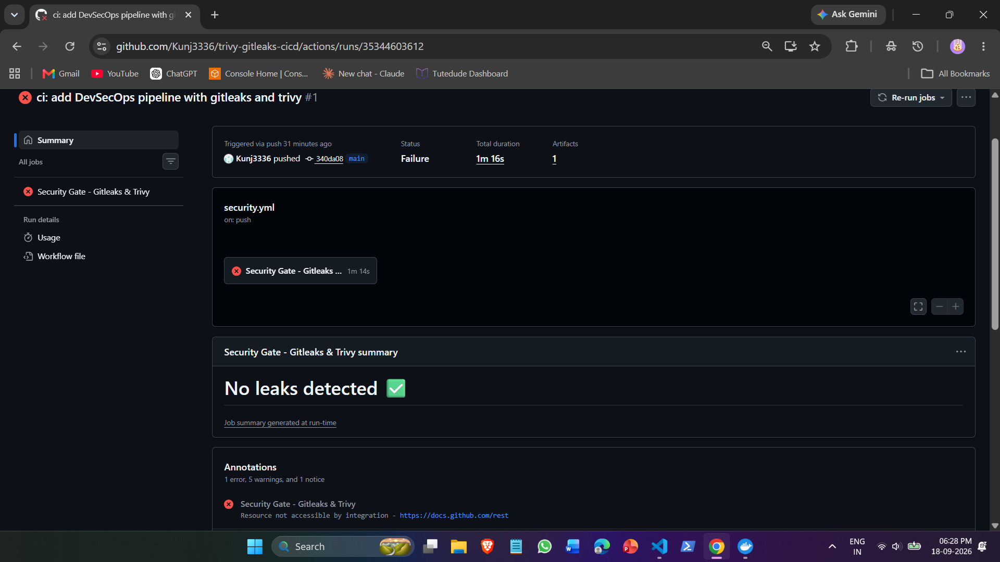

# Research & Development: Trivy & Gitleaks on CI/CD Pipeline

## Executive Summary
This project evaluates **Gitleaks** (source code secret detection) and **Aqua Security Trivy** (container vulnerability analysis) for integration into automated CI/CD workflows. The goal is to establish enforceable security gates that block leaked credentials in Git history and stop vulnerable container images before deployment to production environments such as HashiCorp Nomad clusters.

---

## R&D Objective

The R&D question for this project is:

> **How can Gitleaks and Trivy be integrated into a CI/CD pipeline to detect exposed secrets and vulnerable container images before deployment?**

The investigation focuses on five areas:

1. **Detection** — What types of security issues can each tool identify?
2. **Pipeline Placement** — At which stage should each scanner run?
3. **Security Gates** — Under what conditions should the pipeline stop?
4. **Reporting** — Which output formats are useful for developers, automation, and security dashboards?
5. **Deployment Integration** — How could the scanning strategy be extended to a private registry and deployment platform?

---

## Architecture & Scanning Workflow

```text
       [ Developer Push / Pull Request ]
                       │
                       ▼
            ┌─────────────────────┐
            │  Stage 1: Gitleaks  │
            │   (Secret Scan)     │
            └──────────┬──────────┘
                       │
       ┌───────────────┴───────────────┐
       ▼                               ▼
 [ Secret Found ]             [ No Leaks Clean ]
       │                               │
       ▼                               ▼
  BUILD FAILED                ┌──────────────────┐
 (Pipeline Blocked)           │  Stage 2: Tests  │
                              └────────┬─────────┘
                                       │
                                       ▼
                              ┌──────────────────┐
                              │  Stage 3: Docker │
                              │      Build       │
                              └────────┬─────────┘
                                       │
                                       ▼
                              ┌──────────────────┐
                              │ Stage 4: Trivy   │
                              │  Container Scan  │
                              └────────┬─────────┘
                                       │
                       ┌───────────────┴───────────────┐
                       ▼                               ▼
             [ Critical/High CVE ]            [ Passed Policy ]
                       │                               │
                       ▼                               ▼
               PROMOTION BLOCKED              ┌──────────────────┐
              (Exit Code Non-Zero)            │ Stage 5: Export  │
                                              │  SARIF & JSON    │
                                              └────────┬─────────┘
                                                       │
                                                       ▼
                                              ┌──────────────────┐
                                              │ Deploy / Promote │
                                              │ to Nomad Cluster │
                                              └──────────────────┘
```

### Strategic Placement
* **Pre-Build (Gitleaks):** Analyzes raw commits and source code before any Docker compilation. Catching secrets here guarantees credentials never get baked into intermediate Docker image layers.
* **Post-Build (Trivy):** Scans the freshly built container artifact (`trivy-gitleaks-poc-app:latest`). It audits the underlying OS filesystem (Debian packages) as well as application runtime dependencies (Python packages).
* **Pre-Deploy (Security Gate):** Determines whether an image meets compliance thresholds before allowing registry push or scheduling on Nomad orchestration clusters.

---

## Source Files & Test Fixtures

### 1. Application (`app.py`)
```python
# Simple dummy service for Security POC
print("Security POC Service Running!")
```

### 2. Docker Configuration (`Dockerfile`)
```dockerfile
FROM python:3.9-slim
WORKDIR /app
COPY app.py .
CMD ["python", "app.py"]
```

### 3. Test Fixture (`config.env`)
```text
DEV_FAKE_GITHUB_TOKEN=REMOVED_NO_SECRET_HERE
```
*(Used to trigger negative/positive pipeline security tests).*

---

## R&D Evaluation: Tool Comparison & Output Analysis

### 1. Container Vulnerability Scanners
| Tool | Scope | DB Freshness | CI/CD Integration | License |
| :--- | :--- | :--- | :--- | :--- |
| **Aqua Trivy** | OS packages, language dependencies, IaC, secrets | Daily cache updates | Official GitHub Action & standalone CLI | Open Source (Apache 2.0) |
| **Anchore Grype** | OS packages and language dependencies | Frequent feed updates | GitHub Action / CLI | Open Source (Apache 2.0) |
| **Clair** | OS packages (RPM, DEB, APK) | Regular updates | Requires external PostgreSQL database | Open Source (Apache 2.0) |
| **Snyk Container** | OS packages & base layer recommendations | Managed feed | SaaS API / CLI | Commercial / Freemium |

### 2. Secret Scanners
| Tool | Detection Engine | Speed | Operational Strengths |
| :--- | :--- | :--- | :--- |
| **Gitleaks** | Regex patterns + Shannon entropy | Very fast (compiled Go) | Native GitHub Action, light footprint, local pre-commit hook |
| **Trufflehog** | Regex + active API credential verification | Slower (network pings) | Verifies if detected keys are live |
| **detect-secrets** | Baseline-driven heuristics | Fast | Focuses on developer pre-commit drift management |

### 3. Output Formats Evaluated
| Format | Structure | Primary Use Case |
| :--- | :--- | :--- |
| **Table** | Human-readable terminal output | Local developer CLI execution and quick triage. |
| **JSON** | Structured key-value object (`reports/trivy-report.json`) | Machine ingestion, automation scripts, and custom audit logs. |
| **SARIF** | Standard static analysis interchange (`reports/trivy-report.sarif`) | Direct ingestion into GitHub Security tab (Code Scanning alerts). |

### 4. Harbor & Nomad Integration Architecture
* **VMware Harbor Integration:** Trivy functions as the native default vulnerability scanner in Harbor. Harbor can enforce an automated **Deployment Prevention Policy**, preventing images with `CRITICAL` CVEs from being pulled by any cluster.
* **HashiCorp Nomad Security Gate:** Pipeline jobs submit deployment plans (`nomad job run`) referencing signed, promoted tags. By gating the CI process on Trivy scan outcomes, failing builds are rejected before Nomad ever initiates task allocation.

---

## Implementation & Verification Proof

### 1. Local Container Build
Building the baseline sample container image locally:


### 2. Local Secret Detection (Negative Test)
Gitleaks detecting an injected mock secret token pattern in `config.env`:


### 3. Local Clean Scan (Positive Test)
Gitleaks running against clean source code with zero leaks found:


### 4. Local Trivy Container Image Scan
Trivy inspecting the base image layers and displaying findings in a terminal table:


### 5. GitHub Actions Workflow Execution
Automated pipeline running the complete security chain:


### 6. Security Gate Pipeline Failure
Automated pipeline blocking the build immediately at Gitleaks when a secret is committed:


### 7. Centralized Security Dashboard (SARIF Integration)
GitHub Code Scanning dashboard displaying CVE alerts populated directly by Trivy's SARIF export:


---

## Engineering Challenges & Troubleshooting

### Challenge 1: Cross-Scanner Report Interference
* **What was the error:** During local CLI testing, Gitleaks scanned the entire workspace including `reports/trivy-report.json` and reported secret leaks on Debian package GPG signatures found inside Trivy's vulnerability report.
* **Solution:** Decoupled the scanning order in CI/CD. Gitleaks runs strictly before the container build and before any scan reports are written to disk, preventing scanner artifacts from generating false positives.

### Challenge 2: GitHub Actions Code Scanning API Authorization
* **What was the error:** The GitHub Actions workflow failed at the `Upload Trivy SARIF Report` step with: `Error: Resource not accessible by integration`.
* **Evidence:**

* **Root Cause:** By default, GitHub's temporary runner `GITHUB_TOKEN` does not have write permissions to upload findings to the Code Scanning security endpoint.
* **Solution:** Added explicit token permissions to the GitHub Actions workflow definition:
```yaml
permissions:
  contents: read
  security-events: write
```
This granted the workflow permission to write to the Code Scanning API, allowing the SARIF alerts to publish directly to the repository's Security tab.